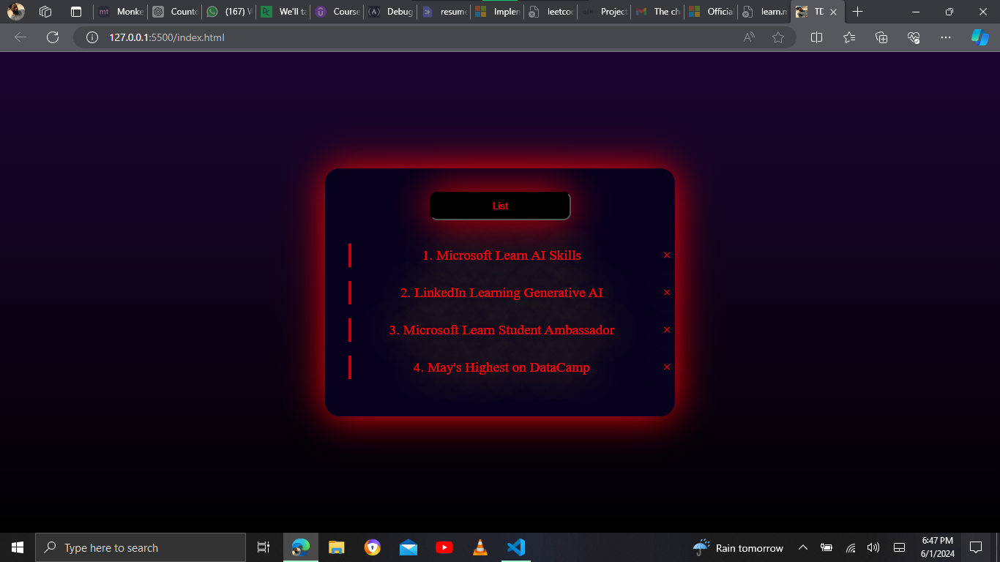

# TDLst

A simple and interactive To-Do List application built using HTML, CSS, and JavaScript. This application allows users to manage their daily tasks efficiently by adding and deleting tasks.

## Features

- **Add Task**: Users can add new tasks to the list.
- **Delete Task**: Users can delete tasks from the list.

## Technologies Used

- **HTML**: For the basic structure of the application.
- **CSS**: For styling the application.
- **JavaScript**: For the functionality of the application.

## Demo
[Click here to see the live demo](https://ademolaademeso-tdlst.vercel.app)

## Screenshots



## Getting Started

### Prerequisites

You need a web browser to run this application.

### Installation

1. **Clone the repository:**
   ```bash
   git clone https://github.com/KingDez04/TDLst.git
   ```

2. **Navigate to the project directory:**
    ```bash
    cd TDLst
    ```

3. **Open the index.html file in your web browser:**
    ```bash
    open index.html
    ```